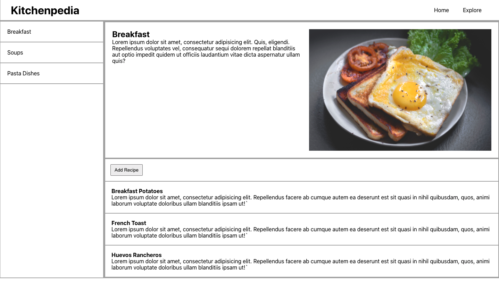

## Recipes App - Set Up Components

For this code-along activity we are going to be building an app to help users keep track of their recipes. The user will be able to browse recipes by categories, such as breakfast, lunch, and dinner, and create recipes of their own.

When we are finished today, it will look something like this. Refer back to this screen shot often as we work through the code along activity. It helps to keep a visual representation of what we are building in your head.



## Initial Setup

We'll use `create-react-app` to setup our React development environment. `create-react-app` is an NPM package that will handle the details of setting up a React project for us. It will install the necessary dependancies, and set up a server to serve our front end files to the browser. It will also watch our files for any changes and automatically update the browser when we save a file, also called "hot reloading".

In your terminal, navigate to the directory where you would like to create your React app. And then run the following commands.
```bash
$ npx create-react-app my-app
$ cd my-app
$ npm start
```

The command may take a few minutes to complete depending on your internet connection. `create-react-app` will create a new directory for our React project. For our example it will create a directory called 'my-app'. Inside the directory it will set up our React environment, complete with a server that will serve our React app to the browser.

We're using `npx` instead of `npm` here. `npx` allows us to run `create-react-app` without downloading the `create-react-app` package to our machines. `npx` allows us to run a hosted version of the package instead.

Navigate into the directory for your new React project.
```bash
cd my-app
```

And then start up the server.
```bash
npm start
```

We'll want to keep this server running while we are working on our app. You can now view your React app at `http://localhost:3000`! Take a look.

Open your new React app up in your code editor and take a look inside.

Along with installing the necessary dependencies, `create-react-app` creates an initial app skeleton that looks like this...

```bash
├──README.md
├──  favicon.ico
├──  index.html
├──  node_modules
├──  package.json
├──  public
│     └──index.html
└──  src
      ├──  App.css
      ├──  App.js
      ├──  index.css
      ├──  index.js
      └──  logo.svg
```

Take some time and look at what's been generated. Specifically look at `index.html`, `index.js`, and `App.js` inside the `public` directory and the `src` directory.

### Some CSS

We are going to have a minimal amount of CSS for this activity to make it easier for us to work on. Delete the existing CSS inside of `./src/App.css` and paste in the following code.

<details>
  <summary>CSS for our Recipes App</summary>

  ```css
  * {
    margin: 0;
    padding: 0;
    box-sizing: border-box;
  }

  ul {
    list-style: none;
  }

  a {
    text-decoration: none;
    color: #000;
  }

  a:visited {
    color: inherit;
  }

  button {
    padding: 6px 8px;
    margin: 0 20px 20px 0;
    cursor: pointer;
  }

  /* SITEWIDE *********************************************** */
  .container {
    max-width: 1000px;
    margin: 0 auto;
  }

  /* HEADER ************************************************* */
  .header {
    border: 2px solid #aaa;
    padding: 0 30px;
    display: flex;
    justify-content: space-between;
    align-items: center;
  }

  .navList {
    display: flex;
  }

  .navLink {
    display: block;
    padding: 20px;
  }

  .navLink:hover {
    color: orange;
  }

  .main-page {
    display: flex;
  }

  /* SIDEBAR ************************************************* */
  .sidebar {
    width: 240px;
    min-width: 300px;
    border: 2px solid #aaa;
  }

  .sidebar-card {
    display: flex;
    padding: 20px;
    border-bottom: 2px solid #aaa;
    cursor: pointer;
  }

  .sidebar-card:hover {
    background: #efefef;
  }

  /* category INFO *********************************************** */
  .category-info {
    border: 2px solid #aaa;
    flex-grow: 1;
  }

  .category-detail {
    border: 2px solid #aaa;
    display: flex;
    justify-content: space-between;
    padding: 20px;
  }

  .category-content {
    padding-right: 15px;
  }

  .category-img {
    width: 525px;
    max-width: 50%;

  }

  /* RECIPES SECTION ******************************************* */
  .recipes-section {
    border: 2px solid #aaa;
    cursor: pointer;
  }

  .add-recipe-button {
    margin: 15px;
    padding: 7px 10px;
  }

  .recipe {
    border-top: 2px solid #aaa;
    padding: 18px;
  }

  .recipe:hover {
    background: #efefef;
  }

  /* RECIPE ADD PAGE ******************************************** */
  .form {
    margin: 0 auto;
    max-width: 1000px;
    padding: 20px;
  }

  .form-header {
    margin-bottom: 20px;
  }

  .form-group {
    display: flex;
    margin-bottom: 10px;
  }

  .form-label {
    width: 100px;
  }

  .form-input {
    width: 100%;
    border-radius: 3px;
    border: 2px solid #aaa;
    padding: 5px;
  }

  .form-input-body {
    height: 200px;
  }
  /* SHOW RECIPE PAGE **************************************** */
  .show-recipe-page {
    margin: 0 auto;
    max-width: 1000px;
    padding: 20px;
  }

  .recipe-category-name,
  .recipe-title,
  .recipe-body {
    margin-bottom: 10px;
  }
  ```
</details>

---

### Adding the Header Component

First let's create a `Header` component for our app. Create a `Header.js` file inside of the components directory.

```bash
touch ./src/components/Header.js
```

Inside of `Header.js` let's set up our `Header` component that returns the **JSX** for our header. It will include the app name and some navigation links.

```javascript
function Header() {
  return (
    <header className="header">
      <h1 className="header-title">Kitchenpedia</h1>

      <nav>
        <ul className="navList">
          <li><a className="navLink" href="/">Home</a></li>
          <li><a className="navLink" href="/">Explore</a></li>
        </ul>
      </nav>
    </header>
  );
}

export default Header;
```

We can now import our `Header` component into the `App.js` file and then render it inside of our `App` component. Let's get rid of the `Person` and `Dog` components as well.

```javascript
import Header from './components/Header';
import './App.css';

function App() {
  return (
    <div className="App">
      <Header />
    </div>
  );
}

export default App;
```

---

### Set Up the Home Page

Our app is going to be organized into different "pages" that the user can view. Let's create a `pages` directory where we will store all of our page components.

```bash
mkdir ./src/pages
```

Within the `pages` directory create a file called `HomePage.js` for our `HomePage` component.

```bash
touch ./src/pages/HomePage.js
```

Inside of `HomePage.js` set up a simple **React component** that returns some **JSX**.

```javascript
function HomePage() {
  return (
    <div className="container">
      <h1>Welcome to Kitchenpedia</h1>
    </div>
  );
}

export default HomePage;
```

We can now import the `HomePage` component into our `App.js` file and render it inside of our `App` component right under the `Header` component.

```js
import Header from './components/Header';
import HomePage from './pages/HomePage';
import './App.css';

function App() {
  return (
    <div className="App">
      <Header />
      <HomePage />
    </div>
  );
}

export default App;
```

---

### Set Up the Main Page

Let's create a `MainPage` component where we will be able select a category and view recipes for that category.

```bash
touch ./src/pages/MainPage.js
```
Inside of `MainPage.js` let's set up our component
```js
function MainPage() {
  return (
    <div className="main-page">
      
      <aside className="sidebar">
        Category Sidebar
      </aside>

      <main className="category-info">
        
        <section className="category-detail">
          Category Details
        </section>

        <section className="recipes-section">
          Recipes Section
        </section>
      </main>
    </div>
  );
}

export default MainPage;
```

Now import the `MainPage` component into the `App.js` file and render the `MainPage` component in the `App` component.

```js
import Header from './components/Header';
import HomePage from './pages/HomePage';
import MainPage from './pages/MainPage';
import './App.css';

function App() {
  return (
    <div className="App">
      <Header />
      {/* <HomePage /> */}
      <MainPage />
    </div>
  );
}

export default App;
```

Let's see what we have in the browser now. Alright, now we can see our header and the basic layout of our main page. Eventually we will be able to select a category from the sidebar and view information about that category and the recipes for that category.

We eventually want to be able to switch between the `HomePage` component and the `MainPage`component by clicking on the navigation links. For now though, to switch between them we can comment one out and uncomment the one we want to see. Let's comment out the `HomePage` component and uncomment the `MainPage` component.

---

### Add a Sidebar Component

Let's flesh out our `MainPage` component some more by creating some child components to render within it.

Because we will be creating a lot of components it will help us to create some additional structure. Let's create a directory called `mainPageComponents` inside of our `components` directory.

```bash
mkdir ./src/components/mainPageComponents
```

Within our `mainPageComponents` directory let's create a `Sidebar.js` file for our `Sidebar` component.

```bash
touch ./src/components/mainPageComponents/Sidebar.js
```

Inside of `Sidebar.js` define the `Sidebar` component.

```js
function Sidebar() {
  return (
    <aside className="sidebar">
      <ul>
        <li className="sidebar-card">Breakfast</li>
        <li className="sidebar-card">Soups</li>
        <li className="sidebar-card">Pasta Dishes</li>
      </ul>
    </aside>
  );
}

export default Sidebar;
```

And then let's render the `Sidebar` component within the `MainPage` component.

```js
import Sidebar from '../components/mainPageComponents/Sidebar';

function MainPage() {
  return (
    <div className="main-page">
      
      <Sidebar />

      <main className="category-info">
        
        <section className="category-detail">
          Category Details
        </section>

        <section className="recipes-section">
          Recipes Section
        </section>
      </main>
    </div>
  );
}

export default MainPage;
```

---

### Category Detail and Recipes Section

Let's set up the `CategoryDetail` component and the `RecipesList` component.

```bash
touch ./src/components/mainPageComponents/CategoryDetail.js
touch ./src/components/mainPageComponents/RecipesList.js
```

The `CategoryDetail` component will display some information about the featured category.

In `CategoryDetail.js`
```js
function CategoryDetail() {
  return (
    <div className="category-detail">
      <div className="category-content">
        <h2>Breakfast</h2>
        <p>Lorem ipsum dolor sit, amet consectetur adipisicing elit. Velit quas architecto a aliquam voluptas omnis debitis ut sint, incidunt officia maxime? Assumenda voluptate, sint id cupiditate optio aliquid deleniti beatae?</p>
      </div>

      
    </div>
  );
}

export default CategoryDetail;
```

The `RecipesList` component will display a list of recipes for that particular category. For now we'll hard code some made up recipes for the breakfast category.

In `RecipesList.js`
```js
function RecipesList() {
  return (
    <section className="recipes-section">
      <button className="add-recipe-button">
        Add Recipe
      </button>

      <article className="recipe">
        <h4>Breakfast Potatoes</h4>
        <p>Lorem ipsum dolor sit amet consectetur adipisicing elit. Blanditiis quidem corporis facilis, placeat pariatur unde mollitia magnam ratione deserunt ullam autem, quisquam commodi earum excepturi dolores voluptatem sequi repudiandae beatae!</p>
      </article>
      <article className="recipe">
        <h4>Rolled Oats</h4>
        <p>Lorem ipsum dolor sit, amet consectetur adipisicing elit. Non cum nulla quisquam voluptatem animi fugiat optio dolor harum veritatis eaque perferendis, sunt quasi hic voluptates, error quod obcaecati maxime quo!</p>
      </article>
      <article className="recipe">
        <h4>French Toast</h4>
        <p>Lorem ipsum dolor sit amet consectetur adipisicing elit. Totam sit accusantium quod sed dolorum perferendis deserunt voluptatem. Commodi sed natus adipisci veniam reiciendis eligendi corporis consequatur, ullam enim praesentium fugit.</p>
      </article>
    </section>
  );
}

export default RecipesList;
```
---

Now in our `MainPage` component we can import the `CategoryDetail` component and the `RecipesList` component. And then we can render them inside the `MainPage` component. In this way the `CategoryDetail` and `RecipesList` components are child components to the `MainPage` component. And the `MainPage` component is a child of the `App` component.

```js
import Sidebar from '../components/mainPageComponents/Sidebar';
import CategoryDetail from '../components/mainPageComponents/CategoryDetail';
import RecipesList from '../components/mainPageComponents/RecipesList';

function MainPage() {
  return (
    <div className="main-page">
      <Sidebar />
      <main className="category-info">
        <CategoryDetail />
        <RecipesList />
      </main>
    </div>
  );
}

export default MainPage;
```

---

### Creating a Recipe Component

Take a look back at the recipes component in `RecipesList.js`. You'll notice that each recipe follows the same exact structure and we're repeating a lot of code here unnecessarily. Let's create a `Recipe` component that we can render iside the `RecipesList` component for each recipe.

```bash
touch ./src/components/mainPageComponents/Recipe.js
```

For now we can copy the **JSX** of one of our recipes and paste it in the `Recipe` component.

```js
function Recipe() {
  return (
    <article className="recipe">
      <h4>Breakfast Potatoes</h4>
      <p>Lorem ipsum dolor sit amet consectetur adipisicing elit. Blanditiis quidem corporis facilis, placeat pariatur unde mollitia magnam ratione deserunt ullam autem, quisquam commodi earum excepturi dolores voluptatem sequi repudiandae beatae!</p>
    </article>
  );
}

export default Recipe;
```

Back in `RecipeList.js` we can import the `Recipe component and render it for each one of our recipes.

```js
import Recipe from './Recipe';

function RecipesList() {
  return (
    <section className="recipes-section">
      <button className="add-recipe-button">
        Add Recipe
      </button>

      <Recipe />
      <Recipe />
      <Recipe />
    </section>
  );
}

export default RecipesList;
```

This makes our `RecipesList` component much easier to read. If we take a look at the app in the browser, you'll notice that we are repeating the same recipe three times. Right now we are hard coding the "Breakfast Potatoes" content in the `Recipe` component. In the next section we are going to learn how we can pass information to a component so that it renders with different content each time using something called **React props**.

---

Alright, taking a look at our app in the browser, we can see our Recipes App start to come to life. None of the buttons work but the general features of the page are all there. Take some time to look over the code that we have written so far and trace how it all fits together. Start with the `index.js` file and work your way down the component tree. The `App` component is the parent of the `MainPage` component. The `MainPage` component is a parent to the `RecipesList` component and so forth. Trace the flow of components multiple times until you are sure you understand it. We are going to be building on all of this information in the next unit.

That concludes the code along for this lesson. We are starting to get a sense for how a React application can be constructed with these building blocks called **components**.

## Additional Resources

The [React documentation](https://reactjs.org/) is incredibly well put together and a great place to learn more about React.

The [Introductory Tutorial](https://reactjs.org/tutorial/tutorial.html) featured on the React documentation will give you a great introduction to using **props** and **state** in React and will be a good primer on some of the topics we will be covering in the next few lessons.